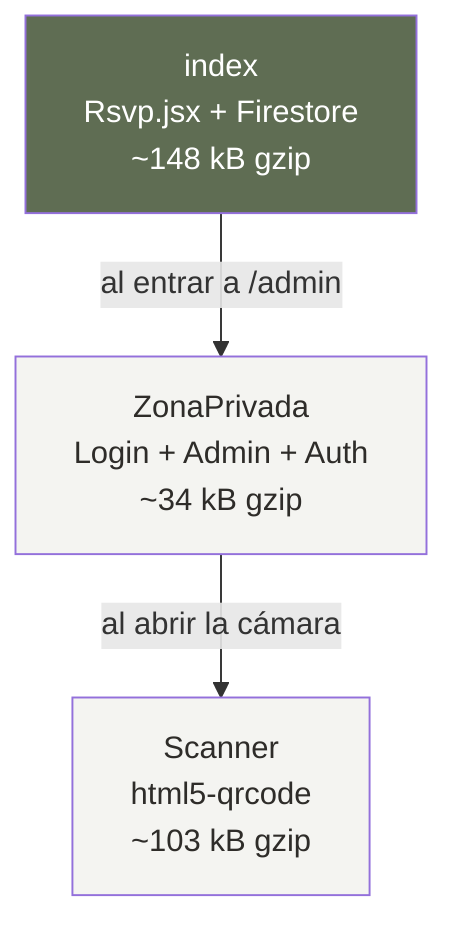
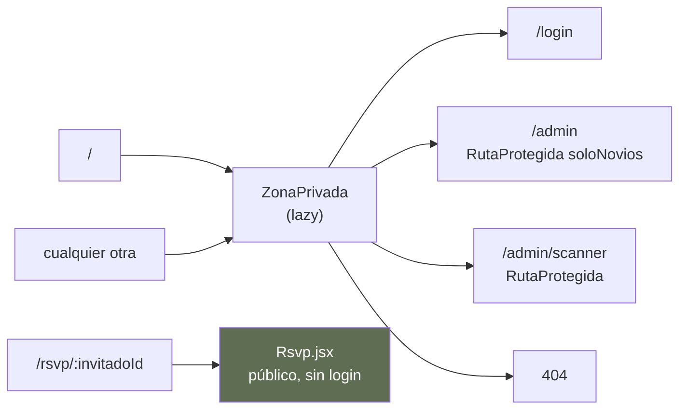

# Arquitectura del frontend

Cómo está construido el sitio y **por qué** está construido así. Si buscas cómo usarlo
en el día a día, ve a [GUIA.md](GUIA.md); si buscas qué falta, a
[PENDIENTES.md](PENDIENTES.md).

---

## 1. El problema que resuelve la forma del código

Casi todas las decisiones raras de este proyecto salen de que **hay tres usuarios muy
distintos** y uno de ellos manda sobre todos los demás.

| Quién           | Dónde               | Cuántas veces | Condiciones                              |
| --------------- | ------------------- | ------------- | ---------------------------------------- |
| **El invitado** | `/rsvp/:invitadoId` | Una           | Celular, datos móviles, link de WhatsApp |
| **Los novios**  | `/admin`            | Decenas       | Celular o escritorio, wifi               |
| **La puerta**   | `/admin/scanner`    | ~100 escaneos | Celular, de noche, con gente esperando   |

El invitado es quien manda. Abre el link una sola vez, desde WhatsApp, con datos móviles
y probablemente con mala señal. **Todo lo que pese en su página es peso que paga cada
uno de los invitados**, y no hay segunda oportunidad: si tarda, no confirma.

De ahí sale la decisión estructural más importante del proyecto, la del punto 3.

---

## 2. Stack

| Pieza          | Qué                                        |
| -------------- | ------------------------------------------ |
| React 18       | Sin framework encima                       |
| Vite 5         | Build y servidor de desarrollo             |
| React Router 6 | Rutas                                      |
| Tailwind 3.4   | Estilos, con tokens propios                |
| Firebase 10    | Firestore (datos) y Auth (las dos cuentas) |
| Vitest         | Tests de la lógica pura                    |

**No hay gestor de estado global** — ni Redux, ni Zustand, ni React Query. Tampoco
TypeScript. Es deliberado: el estado compartido de verdad es uno solo (la sesión), y
Firestore ya resuelve la sincronización con `onSnapshot`. Meter una capa de caché encima
de algo que ya es reactivo habría añadido un sitio más donde los datos pueden quedar
viejos.

---

## 3. La separación de bundles

**Esto es un requisito, no una optimización.** Es lo primero que hay que entender antes
de tocar un import.

El código está partido en tres trozos que se descargan por separado:



El invitado descarga **solo el primero**. Nunca baja el SDK de autenticación ni la
librería del escáner, que él jamás va a usar.

### Qué lo sostiene

Son tres reglas, y las tres se rompen con un import distraído:

1. **[src/lib/firebase.js](../src/lib/firebase.js) exporta `app` y `db`, nunca `auth`.**
2. **[src/lib/auth.js](../src/lib/auth.js) solo se importa desde `AuthContext`.** Existe
   únicamente para aislar el SDK de Auth en su propio módulo.
3. **[src/App.jsx](../src/App.jsx) carga `ZonaPrivada` con `lazy()`**, y `ZonaPrivada`
   hace lo mismo con `Scanner`.

Importar `auth.js`, `Admin.jsx` o `Scanner.jsx` desde cualquier código que alcance la
ruta `/rsvp/:id` duplica el peso de la página pública. **Antes de partirlo pesaba 272 kB
gzip; ahora 148.**

[src/lib/bundles.test.js](../src/lib/bundles.test.js) lo vigila: recorre el grafo de
imports **estáticos** desde `main.jsx` y falla si alcanza `auth.js`, `AuthContext`,
`ZonaPrivada`, `Login`, `Admin` o `Scanner`, imprimiendo la cadena de imports culpable.
Los `import()` dinámicos no cuentan porque son el mecanismo del corte. Aun así, conviene
mirar que `npm run build` siga sacando tres chunks: el test protege el grafo, no el peso.

---

## 4. Rutas



Dos detalles que sorprenden:

- **`/` redirige a `/admin`**, no a una portada. No hay home pública: el sitio existe
  para los links personales y para el staff.
- **Cualquier ruta que no sea `/rsvp/:id` descarga `ZonaPrivada`**, incluidos los 404.
  Es aceptable porque a un 404 solo llega el staff o alguien que tecleó mal.

---

## 5. Cómo se mueven los datos

No hay capa de datos. Cada pantalla habla con Firestore directamente, y **la forma de
hablar cambia según lo que necesite**:

| Pantalla      | Cómo lee                                  | Por qué                                                                                                      |
| ------------- | ----------------------------------------- | ------------------------------------------------------------------------------------------------------------ |
| `Rsvp.jsx`    | `getDoc` × 2 en paralelo (`Promise.all`)  | Una lectura y a correr. El menú se pide a la vez; si no está configurado, la página funciona igual           |
| `Admin.jsx`   | `onSnapshot` sobre la colección y el menú | Los novios lo dejan abierto y quieren ver entrar las confirmaciones                                          |
| `Scanner.jsx` | `onSnapshot` sobre la colección           | Mantiene la lista entera en memoria para que buscar por nombre sea instantáneo y no gaste lecturas por tecla |

### La transacción de la puerta

El registro de acceso va en `runTransaction`
([Scanner.jsx:74](../src/pages/Scanner.jsx#L74)). No es adorno: **si dos celulares
escanean a la vez**, sin transacción los dos leerían `entradaRegistrada: false` y los dos
contarían la entrada como primera vez. El conteo de personas dentro del salón quedaría
descuadrado justo cuando importa.

La transacción devuelve un veredicto tipado —`valido`, `yaUsado`, `noConfirmo`,
`noEncontrado`— y la pantalla solo elige colores según eso.

---

## 6. Autenticación y roles

**Solo existen dos cuentas.** Están escritas en
[src/lib/roles.js](../src/lib/roles.js) como lista blanca:

```
CORREO_NOVIOS   → control total
CORREO_ESCANER  → leer la lista y marcar accesos
```

Cualquier otra cuenta que llegue a existir **no puede hacer nada, ni siquiera leer**.
Antes `esNovios()` era «tener sesión y no ser el escáner», así que una cuenta creada por
error tenía control total.

El rol se decide por el correo y no con _custom claims_. Con dos cuentas fijas, tenerlo
escrito es más simple y auditable, y los claims además obligan a cerrar sesión para
refrescar el token.

**Los mismos correos están duplicados en [firestore.rules](../firestore.rules).** No es
un descuido: el navegador decide qué se _ve_, las reglas deciden qué se _puede_. Si
cambias uno hay que cambiar los dos y republicar;
[src/lib/reglas.test.js](../src/lib/reglas.test.js) falla si se desincronizan.

### El contexto, partido en dos archivos

- [`AuthContext.jsx`](../src/context/AuthContext.jsx) — solo el proveedor
- [`contextoAuth.js`](../src/context/contextoAuth.js) — el contexto y el hook `useAuth`

Están separados porque **un archivo que exporta componentes y no-componentes a la vez
rompe el hot reload de Vite**: al editarlo recarga la página entera en vez de conservar
el estado. Además, `contextoAuth.js` no importa `lib/auth.js`, así que consumir el hook
no arrastra el SDK.

### La interfaz esconde, las reglas protegen

[`RutaProtegida`](../src/components/RutaProtegida.jsx) y los botones ocultos son
**comodidad, no seguridad**. Cualquier permiso nuevo tiene que existir en
`firestore.rules` o no existe.

---

## 7. Las tres capas

```
src/lib/        lógica pura      sin React, sin Firebase, con tests
src/components/ piezas           reutilizables, sin saber de Firestore
src/pages/      pantallas        aquí y solo aquí se habla con Firestore
```

### `src/lib` — donde vive lo que tiene consecuencias físicas

Es la única parte con tests (84, en medio segundo) porque **de aquí sale el número que se
le entrega al salón**. Un error aquí son sillas de más o platos de menos el día del
evento.

| Módulo                                        | Qué hace                                |
| --------------------------------------------- | --------------------------------------- |
| [menu.js](../src/lib/menu.js)                 | Tiempos, opciones por comensal, conteos |
| [acompanantes.js](../src/lib/acompanantes.js) | Lectura tolerante, conteos, nombres     |
| [roles.js](../src/lib/roles.js)               | Perfil según el correo                  |
| [texto.js](../src/lib/texto.js)               | `normalizar()` para buscar sin acentos  |
| [evento.js](../src/lib/evento.js)             | Textos del evento (fecha, lugar)        |
| [firebase.js](../src/lib/firebase.js)         | `app` y `db`                            |
| [auth.js](../src/lib/auth.js)                 | `auth`, aislado a propósito             |

No hay tests de componentes ni de integración con Firebase, y **no se montó jsdom a
propósito**: por eso la suite entera tarda medio segundo. Si añades un test que necesite
DOM, tendrás que añadir `jsdom` y un `environment` propio para ese archivo.

---

## 8. Modelo de datos, en lo que afecta al frontend

Colección `invitados`, un documento por **titular**. Colección `configuracion`, documento
único `menu`.

**Los acompañantes no son documentos.** Son lugares que cuelgan del titular, sin link ni
QR propios; un QR vale por todo el grupo. Es lo que hace viable dar de alta a mano: una
familia de cuatro es _un_ invitado con tres acompañantes, no cuatro invitados.

Consecuencia para el frontend: **todos los contadores cuentan personas, no documentos.**
`totalPersonas(invitado)` es la función que hay que usar; sumar `invitados.length` da un
número que no sirve para nada.

### `menuAcompanantes` va separado de `acompanantes`

Parece redundante y no lo es. Si las elecciones de menú vivieran dentro de
`acompanantes`, para que el invitado pudiera elegir habría que darle permiso de escritura
sobre ese campo — **y podría editar su link para regalarse lugares**. Por eso son dos
campos, y por eso `menuValido()` en las reglas rechaza listas de menú más largas que los
acompañantes reales.

### El público solo puede escribir 6 campos

`confirmacion`, `restricciones`, `mensaje`, `fechaConfirmacion`, `menu`,
`menuAcompanantes`.

Si añades una pregunta al formulario del invitado y no la metes en
`soloCamposDeConfirmacion()`, su confirmación falla con _Missing or insufficient
permissions_.

---

## 9. Sistema de diseño

**Los colores se nombran por su uso, no por su color.** No existe `bg-salvia`; existe
`bg-accion`. Así, el día que la paleta cambie, el código no queda diciendo «salvia» sobre
un botón azul.

Dos capas en [src/index.css](../src/index.css):

```
CAPA 1  primitivas   --salvia-oscura: 95 109 83       ← recolorear = editar solo esto
CAPA 2  semánticas   --color-accion:     var(--salvia-oscura)
                     --color-confirmado: var(--salvia-oscura)
```

Que `accion` y `confirmado` apunten al mismo valor no es redundancia: son dos decisiones
que hoy coinciden. Si mañana el confirmado tiene que ser otro verde, se separan aquí sin
tocar ninguna pantalla.

[tailwind.config.js](../tailwind.config.js) expone **solo la capa 2**.

### Tres detalles que rompen cosas en silencio

- **Los valores van en canales RGB sueltos** (`95 109 83`), nunca en hex. Es lo que
  necesita `rgb(var(--x) / <alpha-value>)` para que sigan funcionando los modificadores
  de opacidad. Con un hex, `text-texto/50` **deja de aplicar el alfa sin dar error**, y
  hay unos sesenta sitios que dependen de ello.
- **`.btn` lleva `min-h-11` (44 px)**, el mínimo para tocar con el dedo sin fallar.
  Varios sitios rebajan el alto con `py-2 text-sm`; el mínimo aguanta por debajo de ese
  ajuste. Si creas un pulsable sin `.btn`, dale un alto equivalente.
- **`input`, `textarea` y `select` van a 16 px.** Por debajo, iOS hace zoom al enfocar el
  campo y descoloca la página.

### Mobile-first, con una excepción

Todo se diseña para el celular, incluido el panel: los novios lo consultan desde el
teléfono. La **tabla del panel es el único bloque que no cabe** — va dentro de un
`overflow-x-auto` con `min-w-[820px]`.

---

## 10. Decisiones que parecen errores

Si vas a refactorizar, lee esto antes. Todas tienen una cicatriz detrás.

| Parece que…                                      | Pero…                                                                                                                                                                                                                                                                   |
| ------------------------------------------------ | ----------------------------------------------------------------------------------------------------------------------------------------------------------------------------------------------------------------------------------------------------------------------- |
| `leerAcompanantes()` acepta tres formas de datos | Tolerancia defensiva de cuatro líneas: un documento con forma rara se lee sin tumbar la puerta el día del evento. Está cubierta por tests                                                                                                                               |
| El login no respeta «la ruta a la que ibas»      | Lo hacía, y quien abría `/admin/scanner` sin sesión aterrizaba en el escáner al entrar como novios. Cada cuenta va **siempre** a su sitio                                                                                                                               |
| Con sesión abierta, `/login` no redirige solo    | Lo hacía, y te dejaba encerrado en la cuenta de la puerta sin forma visible de entrar como novios. La sesión de Firebase no caduca: el encierro era permanente                                                                                                          |
| El servidor de desarrollo no acepta `--host`     | Vite sirve desde la raíz, y ahí vive `serviceAccount.json`. Publicado en la red, cualquiera en la misma wifi descargaba la clave de administrador. **Se verificó explotable.** Y tampoco servía para probar la cámara: en `192.168.x.x` el navegador la deniega siempre |
| El oro solo hace líneas de 1 px                  | Tiene 2.9:1 contra el blanco — no da el contraste para ser texto. Antes marcaba «sin responder»; ese trabajo ahora es de `espera`                                                                                                                                       |

---

## 11. Dónde tocar para hacer X

| Quiero…                                 | Toco…                                                  | ¿Republicar reglas? |
| --------------------------------------- | ------------------------------------------------------ | ------------------- |
| Añadir o quitar un tiempo del menú      | **Solo** `CURSOS` en [menu.js](../src/lib/menu.js#L40) | No                  |
| Cambiar toda la paleta                  | **Solo** la capa 1 de [index.css](../src/index.css)    | No                  |
| Cambiar fecha, lugar u hora             | [evento.js](../src/lib/evento.js)                      | No                  |
| Añadir una columna a la tabla o al CSV  | [Admin.jsx](../src/pages/Admin.jsx)                    | No                  |
| Añadir un campo que escribe el invitado | El formulario **y** `soloCamposDeConfirmacion()`       | **Sí**              |
| Cambiar un correo del staff             | `roles.js` **y** `firestore.rules`                     | **Sí**              |

El editor del menú, el selector del invitado, los conteos y el CSV **se generan a partir
de `CURSOS`**. Por eso añadir un tiempo es una línea y no toca reglas: todo vive dentro
de `menu` y `menuAcompanantes`, que ya están permitidos.

---

## 12. Límites conocidos

- **La cámara del escáner no se puede probar en local.** Exige HTTPS o `localhost`; desde
  el celular en `192.168.x.x:5173` **nunca** funciona. La prueba real es en Vercel.
- **La obligatoriedad del menú se valida en el navegador, no en las reglas.** Replicarlo
  ahí obligaría a duplicar toda la lógica de qué opciones le tocan a cada comensal.
- **El QR lleva el ID sin firmar.** La defensa es `entradaRegistrada` (segundo escaneo →
  ámbar) más que el personal ve el nombre en pantalla.
- **No hay tests de interfaz.** Nada comprueba que las pantallas rendericen; eso se ve
  abriendo la app. Lo que sí está cubierto es el grafo de imports
  ([bundles.test.js](../src/lib/bundles.test.js)) y la sincronía de los correos con las
  reglas ([reglas.test.js](../src/lib/reglas.test.js)).
